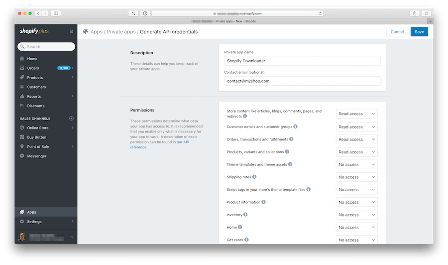

# Shopify Downloader

A Python script for downloading data using the [Shopify API](https://help.shopify.com/api) to local files. 

## Resulting data
By default, it creates three data sets:

1. **Order** This file is always overwritten by the script:

        data/shopify/orders-v1.json.gz

    The resulting JSON file contains an array of dictionaries of orders: 

        [
            {
                "id": 4797830542,
                "email": "john.doe@example.com",
                "closed_at": null,
                "created_at": "2015-03-06T08:46:58+01:00",
                "updated_at": "2015-03-06T08:47:05+01:00",
                "number": 13899,
                "note": null,
                "token": "12345abca50fb5976d71149595962fe0",
                "gateway": "stripe",
                "test": false,
                "total_price": "299.00",
                "subtotal_price": "299.00",
                "total_weight": 3400,
                "total_tax": "47.74",
                "taxes_included": true,
                "currency": "EUR",
                "financial_status": "paid",
                ..
            },
            ..
        ]

2. **Product** information. This file is always overwritten by the script:

        data/shopify/products-v1.json.gz

    The resulting JSON file contains an array of dictionaries of products: 

        [
            {
                "id": 2571704963,
                "title": "Super Cool Product",
                "body_html": "",
                "vendor": "My Awesome Shop",
                "product_type": "Stuff",
                "created_at": "2015-09-14T10:04:09+02:00",
                "handle": "super-cool-product",
                "updated_at": "2017-01-23T18:28:44+01:00",
                "published_at": null,
                "template_suffix": null,
                "published_scope": "global",
                "tags": "",
                "variants": [
                      {
                      },
                      ...
            ..  
        ]

3. **Customer** information. This file is always overwritten by the script:
 
        data/shopify/customers-v1.json.gz

    The resulting JSON file contains an array of dictionaries of customers:
    
        [  
            {
                "id": 5683624142,
                "email": "john.doe@example.com",
                "accepts_marketing": false,
                "created_at": "2017-03-03T21:50:31+01:00",
                "updated_at": "2017-03-03T21:54:25+01:00",
                "first_name": "John",
                "last_name": "Doe",
                "orders_count": 1,
                "state": "disabled",
                "total_spent": "0.00",
                "last_order_id": 4783344718,
                "note": null,
                "verified_email": true,
                "multipass_identifier": null,
                "tax_exempt": false,
                "phone": null,
                "tags": "",
                "last_order_name": "#11483457",
                "default_address": {
                    "id": 5729981966,
                }
            },
            ...
        ]      

## Getting Started

### Prerequisites

To use the Shopify Downloader you have to create an `API_KEY` and a `PASSWORD` to access the Shopify API. See [Create a Shopify password and API key](#create-a-password-and-api-key) for the necessary steps.

### Installation

 The Shopify Downloader requires:

    Python (>= 3.5)
    ShopifyAPI (==2.2.0)
    click (>=6.0)

The easiest way to install shopify-downloader is using pip

    pip install git+https://github.com/mara/shopify-downloader.git

In case you want to install it in a virtual environment:

    $ git clone git@github.com:mara/mara/shopify-downloader.git shopify_downloader
    $ cd shopify_downloader
    $ python3 -m venv .venv
    $ .venv/bin/pip install .

### Create a password and API key 
 
Log into your Shopify account and go to the [Generate API credentials](https://myshop.myshopify.com/admin/apps/private/new) page. Fill out the form: 

## Usage

To run the Shopify Downloader call `download-shopify-data` with its config parameters:  

    $ download-shopify-data \
    --shop_url myshop.myshopify.com \ 
    --api_key 12345a6b7c8d9  \
    --password mysupersecretpassword
    --data_dir /tmp/shopify
